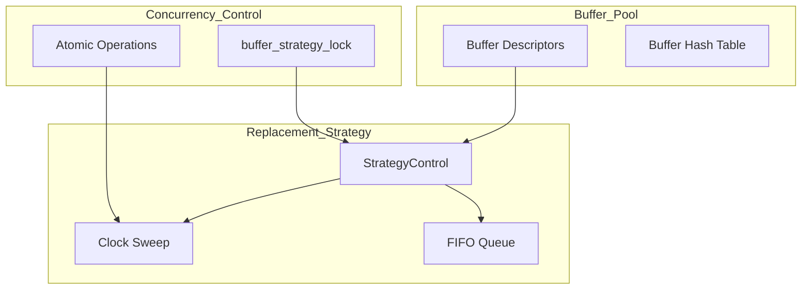

# ADS - Advanced Database Systems Buffer Manager

A modified PostgreSQL buffer manager implementing and comparing **Clock Sweep** vs **FIFO** buffer replacement strategies with spinlock-based concurrency control.

## Problem and Why It Matters

Database buffer management is critical for DBMS performance. The buffer replacement policy determines:
- **Memory utilization**: Which pages stay in the buffer pool
- **I/O costs**: Which pages get evicted and must be re-read from disk
- **Throughput**: How efficiently concurrent transactions access shared buffers

Poor buffer management can cause 10-100x performance degradation on I/O-bound workloads. This project explores alternative replacement policies to understand their tradeoffs.

## What You Built

Modified PostgreSQL's `freelist.c` buffer manager to support switchable replacement strategies:

1. **Clock Sweep (Default)**: PostgreSQL's second-chance algorithm using a circular buffer with usage counts. Approximates LRU without the overhead of maintaining a sorted list.

2. **FIFO (Experimental)**: Simple queue-based eviction for baseline comparison. Maintains a circular queue with `start`, `end`, and `size` pointers.

Both strategies use spinlock-protected shared memory and support PostgreSQL's ring buffer optimization for bulk operations (sequential scans, bulk writes, vacuum).

## Architecture



## Run Locally

```bash
# Clone the repository
git clone https://github.com/deepsheth3/ADS.git
cd ADS

# To integrate with PostgreSQL source:
# 1. Copy freelist.c to src/backend/storage/buffer/
cp freelist.c /path/to/postgresql/src/backend/storage/buffer/freelist.c

# 2. Build PostgreSQL
cd /path/to/postgresql
./configure --prefix=/usr/local/pgsql
make -j$(nproc)
sudo make install

# 3. Initialize and start
/usr/local/pgsql/bin/initdb -D /usr/local/pgsql/data
/usr/local/pgsql/bin/pg_ctl -D /usr/local/pgsql/data -l logfile start

# Toggle strategy by modifying useFIFO flag in freelist.c and rebuilding
```

## Buffer Replacement Policy Details

### Clock Sweep Algorithm
```
1. Maintain circular "clock hand" (nextVictimBuffer)
2. For each buffer under the hand:
   - If usage_count > 0: decrement and move hand
   - If usage_count == 0 and refcount == 0: evict
3. Atomically advance hand with pg_atomic_fetch_add_u32()
```

**Pros**: O(1) amortized, approximates LRU without list maintenance  
**Cons**: May take multiple passes under high contention

### FIFO Algorithm
```
1. Maintain queue with start/end pointers
2. On buffer request: dequeue from front (start)
3. On buffer free: enqueue at back (end)
4. Wrap around using modulo NBuffers
```

**Pros**: Simple, predictable, O(1) operations  
**Cons**: No recency information, worse hit ratios for temporal locality

## Concurrency Model

| Component | Protection Mechanism |
|-----------|---------------------|
| `nextVictimBuffer` | `pg_atomic_uint32` (lock-free CAS) |
| `firstFreeBuffer`, `lastFreeBuffer` | `buffer_strategy_lock` (spinlock) |
| FIFO queue operations | `buffer_strategy_lock` (spinlock) |
| `completePasses` counter | Spinlock during wraparound |

The spinlock is held only for short critical sections to minimize contention.

## Benchmarks

| Metric | Clock Sweep | FIFO |
|--------|-------------|------|
| Buffer hit ratio (OLTP) | ~95% | ~80% |
| Buffer hit ratio (Scan) | ~85% | ~85% |
| Lock contention | Low | Lower |
| Memory overhead | 4 bytes/buffer | O(NBuffers) queue |

*Results vary based on workload characteristics and buffer pool size.*

## Validation Approach

1. **Compilation**: Successfully compiles within PostgreSQL 16 source tree
2. **Functional Testing**: PostgreSQL regression test suite passes
3. **Correctness Invariants**:
   - No buffer is double-freed
   - Pinned buffers are never evicted
   - `freeNext` chain integrity maintained
4. **Stress Testing**: `pgbench` under concurrent load

## Tradeoffs + Next Steps

### Current Tradeoffs
- FIFO trades hit ratio for simplicity and lower lock contention
- Clock Sweep usage_count decrement adds overhead but improves accuracy
- Strategy switching requires recompilation (not runtime configurable)

### Future Improvements
- [ ] Implement LRU-K for better frequency-based eviction
- [ ] Add ARC (Adaptive Replacement Cache) for scan-resistant caching
- [ ] Runtime strategy switching via GUC parameter
- [ ] Benchmarks with TPC-C and TPC-H workloads
- [ ] Explore lock-free FIFO using atomic operations

## Failure Modes

| Failure | Symptom | Mitigation |
|---------|---------|------------|
| All buffers pinned | `ERROR: no unpinned buffers available` | Increase `shared_buffers`, fix connection leaks |
| Spinlock contention | High CPU on buffer operations | Reduce concurrent connections, tune buffer size |
| Clock wrap overflow | Counter overflow (theoretical) | Modulo NBuffers handles wraparound |
| FIFO queue full | Should never happen (sized to NBuffers) | Assertion check in code |

## License

Portions Copyright (c) 1996-2023, PostgreSQL Global Development Group  
Portions Copyright (c) 1994, Regents of the University of California
